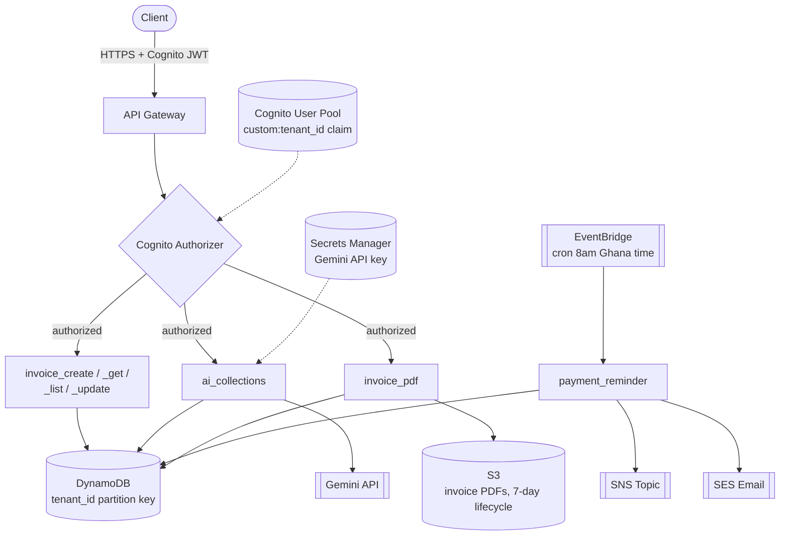

# PayTrack Africa

AI-powered invoice and payment tracking SaaS for Ghanaian SMEs, built for a simulated client (AgroVault Africa Ltd, an accounting firm serving Ghanaian SMEs). Every SME is a fully isolated tenant on shared, multi-tenant serverless infrastructure — one AWS account, one set of DynamoDB tables, tenant data separated entirely by partition key and enforced at every Lambda handler.

Full build spec: [PayTrack_FullBuildSpec.md](PayTrack_FullBuildSpec.md).

## Status

- **Phase 1** (core infra + invoice CRUD API) — done
- **Phase 2** (payment reminders, AI collections messages, PDF generation) — done
- Phase 3 (monitoring/alarms), Phase 4 (Next.js dashboard), Phase 5 (analytics + portfolio polish) — not started

## Architecture



**AWS services used:**
| Service | Why |
|---|---|
| Lambda (Python 3.12) | All business logic, no servers to manage |
| API Gateway | REST API, Cognito-authorized routes |
| Cognito | Auth; `custom:tenant_id` claim drives every tenant-isolation check |
| DynamoDB | `tenant_id` partition key on every table — a request literally cannot read another tenant's data without that key matching |
| S3 | Generated invoice PDFs (7-day lifecycle) and Lambda deployment packages |
| SNS + SES | Payment reminders (SMS-capable topic + email fallback) |
| EventBridge | Daily cron trigger for `payment_reminder` |
| Secrets Manager | Gemini API key, never in code or env files |
| Terraform | All infrastructure as code, no manual console changes |

## API Endpoints

All routes require a Cognito ID token in the `Authorization` header.

| Method | Path | Purpose |
|---|---|---|
| POST | `/invoices` | Create invoice (starts as `draft`) |
| GET | `/invoices` | List invoices (filter by `status`, `due_before`/`due_after`, paginated) |
| GET | `/invoices/{id}` | Get one invoice |
| PUT | `/invoices/{id}` | Update invoice / transition status (`draft`→`sent`→`paid`, or `draft`→`cancelled`) |
| POST | `/invoices/{id}/collect` | Generate an AI collections message (Gemini) for an overdue invoice |
| POST | `/invoices/{id}/pdf` | Generate a PDF and return a 24h presigned S3 URL |

## Deploying From Scratch

```bash
# 1. One-time bootstrap (creates the Terraform state bucket + lock table)
aws s3 mb s3://paytrack-tf-state-2026 --region us-east-1
aws s3api put-bucket-versioning --bucket paytrack-tf-state-2026 --versioning-configuration Status=Enabled
aws dynamodb create-table --table-name paytrack-tf-lock \
  --attribute-definitions AttributeName=LockID,AttributeType=S \
  --key-schema AttributeName=LockID,KeyType=HASH \
  --billing-mode PAY_PER_REQUEST --region us-east-1

# 2. Secret the Gemini API key needs before Terraform will plan/apply
aws secretsmanager create-secret \
  --name paytrack/gemini-api-key \
  --secret-string '{"api_key": "YOUR-GEMINI-KEY-HERE"}' \
  --region us-east-1

# 3. Package and deploy
bash scripts/package_lambdas.sh
cd infrastructure
terraform init
terraform apply -var="state_bucket_name=paytrack-tf-state-2026"
```

Note the outputs (`api_url`, `cognito_user_pool_id`, `cognito_client_id`) — you'll need them below.

SES starts in sandbox mode: `terraform apply` triggers a verification email to the sender address (`ses_sender_email` variable, default `aliutijani21@gmail.com`) — click the link before `payment_reminder` can actually send email.

## Running Tests

```bash
python3.12 -m venv .venv && source .venv/bin/activate
pip install pytest boto3 moto google-genai reportlab
pytest tests/ -v
```

18 tests, all moto-mocked (no AWS account needed): 12 for invoice CRUD/tenant isolation (`tests/test_invoice_api.py`), 6 for the reminder pipeline/PDF/AI collections (`tests/test_reminder_pipeline.py`). The Gemini call in `ai_collections` is monkeypatched in tests — nothing hits a real API.

## Testing Against a Real Deployment

Terraform's outputs give you everything needed for a manual end-to-end smoke test:

```bash
# 1. Create a test user (admin-created, so no self-signup flow needed)
TENANT_ID=$(uuidgen | tr 'A-Z' 'a-z')
aws cognito-idp admin-create-user \
  --user-pool-id <cognito_user_pool_id> \
  --username test@example.com \
  --user-attributes Name=email,Value=test@example.com Name=email_verified,Value=true \
    "Name=custom:tenant_id,Value=$TENANT_ID" \
  --message-action SUPPRESS --region us-east-1

aws cognito-idp admin-set-user-password \
  --user-pool-id <cognito_user_pool_id> \
  --username test@example.com --password 'YourPass123!' --permanent --region us-east-1

# 2. Get a JWT
aws cognito-idp initiate-auth --auth-flow USER_PASSWORD_AUTH \
  --client-id <cognito_client_id> \
  --auth-parameters USERNAME=test@example.com,PASSWORD='YourPass123!' \
  --region us-east-1
# grab .AuthenticationResult.IdToken from the response

# 3. Exercise the API
TOKEN="<the IdToken above>"
API="<api_url output>"

curl -X POST "$API/invoices" -H "Authorization: $TOKEN" -H "Content-Type: application/json" \
  -d '{"client_name":"Test Client","client_email":"you@example.com","amount":100,"due_date":"2026-08-01"}'

curl -X PUT "$API/invoices/<invoice_id>" -H "Authorization: $TOKEN" -H "Content-Type: application/json" \
  -d '{"status":"sent"}'

curl -X POST "$API/invoices/<invoice_id>/pdf" -H "Authorization: $TOKEN"
curl -X POST "$API/invoices/<invoice_id>/collect" -H "Authorization: $TOKEN"

# 4. payment_reminder is cron-triggered (8am Ghana time daily) -- invoke it directly to test without waiting
aws lambda invoke --function-name paytrack-payment_reminder-dev --region us-east-1 /tmp/result.json
cat /tmp/result.json
```

To tear everything down: `terraform destroy -var="state_bucket_name=paytrack-tf-state-2026"` from `infrastructure/`.

## Environment Variables / Secrets Required

| Name | Where | Purpose |
|---|---|---|
| `paytrack/gemini-api-key` | Secrets Manager | Gemini API key for `ai_collections` |
| `AWS_ACCESS_KEY_ID` / `AWS_SECRET_ACCESS_KEY` | GitHub Actions secrets | CI/CD deploy |
| `TF_STATE_BUCKET` | GitHub Actions secrets | Terraform remote state bucket name |
