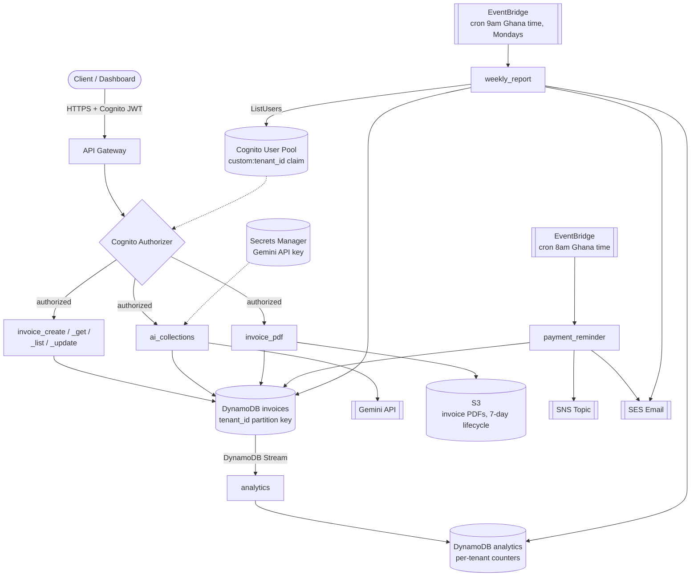

# PayTrack Africa

AI-powered invoice and payment tracking SaaS for Ghanaian SMEs, built for a simulated client (AgroVault Africa Ltd, an accounting firm serving Ghanaian SMEs). Every SME is a fully isolated tenant on shared, multi-tenant serverless infrastructure — one AWS account, one set of DynamoDB tables, tenant data separated entirely by partition key and enforced at every Lambda handler.

Video walkthrough script: [VIDEO_WALKTHROUGH.md](VIDEO_WALKTHROUGH.md).

## Status

All five phases are complete:

- **Phase 1** — core infra + invoice CRUD API
- **Phase 2** — payment reminders, AI collections messages (Gemini), PDF generation
- **Phase 3** — CloudWatch alarms, dashboard, X-Ray tracing, structured logging
- **Phase 4** — Next.js dashboard (`dashboard/`), Cognito-authenticated
- **Phase 5** — DynamoDB Streams → live analytics table, weekly SES digest, this documentation

## Architecture



**AWS services used:**
| Service | Why |
|---|---|
| Lambda (Python 3.12) | All business logic, no servers to manage |
| API Gateway | REST API, Cognito-authorized routes, CORS for the browser dashboard |
| Cognito | Auth; `custom:tenant_id` claim drives every tenant-isolation check |
| DynamoDB | `tenant_id` partition key on every table — a request literally cannot read another tenant's data without that key matching |
| DynamoDB Streams | Drives the `analytics` Lambda off every invoice status change, no polling |
| S3 | Generated invoice PDFs (7-day lifecycle) and Lambda deployment packages |
| SNS + SES | Payment reminders and weekly digests (SMS-capable topic + email) |
| EventBridge | Daily `payment_reminder` cron, weekly `weekly_report` cron |
| Secrets Manager | Gemini API key, never in code or env files |
| CloudWatch + X-Ray | Alarms, dashboard, distributed tracing across API Gateway → Lambda |
| IAM OIDC (GitHub Actions) | CI/CD deploys via a short-lived assumed role, no long-lived AWS keys in GitHub |
| Terraform | All infrastructure as code, no manual console changes |

## Dashboard

`dashboard/` is a Next.js 14 app (App Router, TypeScript, Tailwind) authenticated via AWS Amplify against the same Cognito pool as the API. Invoice list/detail/create, PDF download, AI collections trigger, and an analytics page. See [dashboard/.env.local.example](dashboard/.env.local.example) for the required env vars (`NEXT_PUBLIC_API_URL`, `NEXT_PUBLIC_COGNITO_USER_POOL_ID`, `NEXT_PUBLIC_COGNITO_CLIENT_ID`) — copy to `.env.local` with your deployment's actual values (they change every time infra is destroyed/recreated, which is why they're env vars and not hardcoded).

```bash
cd dashboard
npm install
npm run dev
```

Self-signup is intentionally hidden in the login screen — tenants are admin-provisioned (see "Testing Against a Real Deployment" below), since a self-registered Cognito account has no `tenant_id` and can't use the API.

## API Endpoints

All routes require a Cognito ID token in the `Authorization` header.

| Method | Path | Purpose |
|---|---|---|
| POST | `/invoices` | Create invoice (starts as `draft`) |
| GET | `/invoices` | List invoices (filter by `status`, `due_before`/`due_after`, paginated) |
| GET | `/invoices/{id}` | Get one invoice |
| PUT | `/invoices/{id}` | Update invoice / transition status (`draft`→`sent`→`paid`, or `draft`→`cancelled`) |
| POST | `/invoices/{id}/collect` | Generate an AI collections message (Gemini) for an overdue invoice |
| POST | `/invoices/{id}/pdf` | Generate a PDF and return a 24h presigned S3 URL |

## Deploying From Scratch

```bash
# 1. One-time bootstrap (creates the Terraform state bucket + lock table)
aws s3 mb s3://paytrack-tf-state-2026 --region us-east-1
aws s3api put-bucket-versioning --bucket paytrack-tf-state-2026 --versioning-configuration Status=Enabled
aws dynamodb create-table --table-name paytrack-tf-lock \
  --attribute-definitions AttributeName=LockID,AttributeType=S \
  --key-schema AttributeName=LockID,KeyType=HASH \
  --billing-mode PAY_PER_REQUEST --region us-east-1

# 2. Secret the Gemini API key needs before Terraform will plan/apply
aws secretsmanager create-secret \
  --name paytrack/gemini-api-key \
  --secret-string '{"api_key": "YOUR-GEMINI-KEY-HERE"}' \
  --region us-east-1

# 3. Package and deploy
bash scripts/package_lambdas.sh
cd infrastructure
terraform init
terraform apply -var="state_bucket_name=paytrack-tf-state-2026"
```

Note the outputs (`api_url`, `cognito_user_pool_id`, `cognito_client_id`) — you'll need them for the dashboard's `.env.local` and for manual testing below.

SES starts in sandbox mode: `terraform apply` triggers a verification email to the sender address (`ses_sender_email` variable, default `aliutijani21@gmail.com`) — click the link before `payment_reminder`/`weekly_report` can actually send email. In sandbox mode, recipients also need to be verified individually (`aws ses verify-email-identity --email-address ... --region us-east-1`), which is a real limitation worth knowing about before demoing this live — request SES production access to lift it.

## Running Tests

```bash
python3.12 -m venv .venv && source .venv/bin/activate
pip install pytest boto3 moto joserfc google-genai reportlab
pytest tests/ -v
```

23 tests, all moto-mocked (no AWS account needed): 12 for invoice CRUD/tenant isolation (`tests/test_invoice_api.py`), 6 for the reminder pipeline/PDF/AI collections (`tests/test_reminder_pipeline.py`), 5 for the analytics stream processor and weekly report (`tests/test_analytics.py`, needs `joserfc` for moto's Cognito mock). The Gemini call in `ai_collections` is monkeypatched in tests — nothing hits a real API.

## Testing Against a Real Deployment

Terraform's outputs give you everything needed for a manual end-to-end smoke test:

```bash
# 1. Create a test user (admin-created, so no self-signup flow needed)
TENANT_ID=$(uuidgen | tr 'A-Z' 'a-z')
aws cognito-idp admin-create-user \
  --user-pool-id <cognito_user_pool_id> \
  --username test@example.com \
  --user-attributes Name=email,Value=test@example.com Name=email_verified,Value=true \
    "Name=custom:tenant_id,Value=$TENANT_ID" \
  --message-action SUPPRESS --region us-east-1

aws cognito-idp admin-set-user-password \
  --user-pool-id <cognito_user_pool_id> \
  --username test@example.com --password 'YourPass123!' --permanent --region us-east-1

# 2. Get a JWT
aws cognito-idp initiate-auth --auth-flow USER_PASSWORD_AUTH \
  --client-id <cognito_client_id> \
  --auth-parameters USERNAME=test@example.com,PASSWORD='YourPass123!' \
  --region us-east-1
# grab .AuthenticationResult.IdToken from the response

# 3. Exercise the API
TOKEN="<the IdToken above>"
API="<api_url output>"

curl -X POST "$API/invoices" -H "Authorization: $TOKEN" -H "Content-Type: application/json" \
  -d '{"client_name":"Test Client","client_email":"you@example.com","amount":100,"due_date":"2026-08-01"}'

curl -X PUT "$API/invoices/<invoice_id>" -H "Authorization: $TOKEN" -H "Content-Type: application/json" \
  -d '{"status":"sent"}'

curl -X POST "$API/invoices/<invoice_id>/pdf" -H "Authorization: $TOKEN"
curl -X POST "$API/invoices/<invoice_id>/collect" -H "Authorization: $TOKEN"

# 4. Check that the status change above landed in the analytics table (DynamoDB Streams is
# async -- give it a few seconds)
aws dynamodb get-item --table-name paytrack-analytics-dev --region us-east-1 \
  --key "{\"tenant_id\": {\"S\": \"$TENANT_ID\"}, \"metric_key\": {\"S\": \"invoices_sent\"}}"

# 5. payment_reminder and weekly_report are cron-triggered -- invoke either directly to
# test without waiting for the schedule
aws lambda invoke --function-name paytrack-payment_reminder-dev --region us-east-1 /tmp/result.json
aws lambda invoke --function-name paytrack-weekly_report-dev --region us-east-1 /tmp/result2.json
cat /tmp/result.json /tmp/result2.json
```

To tear everything down: `terraform destroy -var="state_bucket_name=paytrack-tf-state-2026"` from `infrastructure/`.

## CI/CD

`.github/workflows/deploy.yml` runs the test suite on every push/PR to `main`, and on push to `main` also packages and deploys via Terraform. It authenticates to AWS via OIDC (`infrastructure/modules/github_oidc`) — a short-lived role assumed per run, scoped to this repo's `main` branch, no long-lived AWS keys stored in GitHub at all. The only secret required is `AWS_DEPLOY_ROLE_ARN` (the role's ARN, from the `github_oidc_role_arn` Terraform output).

## Environment Variables / Secrets Required

| Name | Where | Purpose |
|---|---|---|
| `paytrack/gemini-api-key` | Secrets Manager | Gemini API key for `ai_collections` |
| `AWS_DEPLOY_ROLE_ARN` | GitHub Actions secrets | IAM role GitHub Actions assumes via OIDC to deploy |
| `NEXT_PUBLIC_API_URL`, `NEXT_PUBLIC_COGNITO_USER_POOL_ID`, `NEXT_PUBLIC_COGNITO_CLIENT_ID` | `dashboard/.env.local` (gitignored) | Wires the frontend to a specific deployment |

## Lessons Learned

- **Test what you build, not just what you write.** Several real bugs only surfaced by actually running things end to end: a placeholder-collision bug in a hand-built `UpdateExpression` that silently overwrote `status` with `tenant_id`; a CORS gap that every `curl`-based test this project ran never could have caught, since `curl` isn't subject to CORS; an unhandled `KeyError` that turned into a raw 502 the first time a real (non-admin-provisioned) Cognito account hit the API. None of these were visible from reading the code — only from driving it.
- **Generic build specs get the broad strokes right and the specifics wrong.** The original spec's Cognito client only allowed `USER_PASSWORD_AUTH`, which is exactly what you'd want for `curl`/CLI testing but silently breaks AWS Amplify's `Authenticator`, which signs in via SRP by default. The lesson isn't "the spec was bad" — it's that a spec optimized for one testing mode (CLI) doesn't automatically cover another (browser), and that gap only shows up once you actually build the second thing.
- **"Well-documented" auth flows can still have undocumented specifics.** GitHub's OIDC `sub` claim inlines immutable numeric IDs after the owner and repo name (`repo:OWNER@id/REPO@id:ref:...`), not the plain `repo:OWNER/REPO:ref:...` format shown in most examples including AWS's own docs. When a trust policy condition silently rejects every attempt with a generic `AccessDenied`, decoding the actual token beats iterating on guesses about its shape.
- **Non-determinism compounds silently.** A packaging script that produces a different zip hash every run (embedded file mtimes, then filesystem-order-dependent archiving, then `.pyc` cache files carrying their own baked-in source hashes) doesn't fail anything — it just makes every `terraform plan` claim things changed when they didn't, which erodes trust in the tool's output and wastes real deploy time. Worth fixing early, not living with.
- **Reversibility discipline paid for itself.** Treating each phase's deploy as build-verify-locally-first, then deploy-and-tear-down-when-done, meant AWS billing risk stayed bounded throughout a long, iterative build — including through several rounds of getting things wrong before getting them right.
