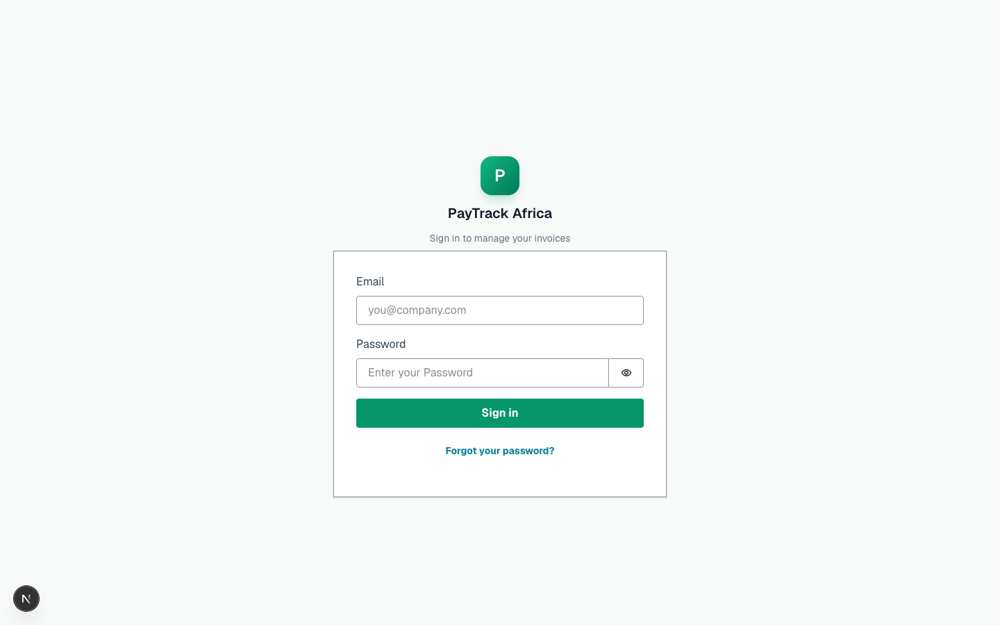
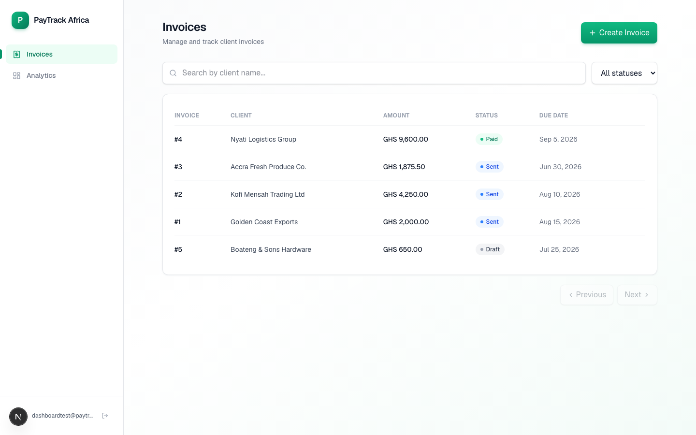
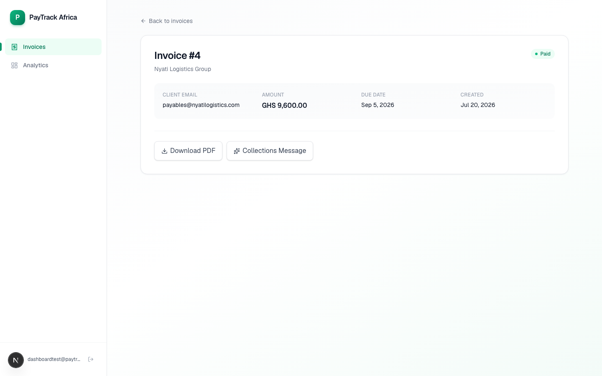
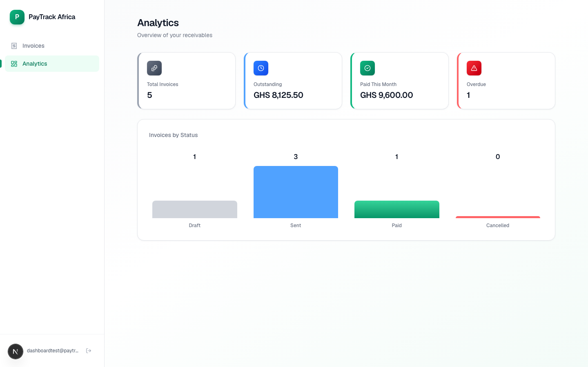

# PayTrack Africa — Video Walkthrough Script

Target length: 3-5 minutes. Screen recording with voiceover, dashboard + AWS console.

---

## 1. The Problem (30s)

*[Screen: title slide or blank]*

> Small accounting firms across Ghana manage invoicing for dozens of SME clients, usually through spreadsheets and manual follow-up calls. Payments slip past due dates, collections messages are written from scratch every time, and there's no shared view of who owes what.
>
> PayTrack Africa is a multi-tenant invoicing platform built for exactly this: each client firm gets a fully isolated workspace on shared infrastructure, automated payment reminders, AI-drafted collections messages, and a live view of outstanding receivables — all running serverless on AWS.

## 2. Sign In and Create an Invoice (60s)

*[Screen: dashboard login page]*

> Here's the dashboard. Authentication is Cognito-backed — every account belongs to exactly one tenant, enforced all the way down to the database partition key, so one firm's client data is never reachable from another firm's login.

*[Screen: log in, land on /invoices, click "Create Invoice"]*

> Let's create an invoice. Client name, email, amount, due date.

*[Fill the form, submit, show it appear in the list as "draft"]*

> It starts as a draft — nothing's been sent to the client yet.

## 3. Update Status and Generate a PDF (45s)

*[Screen: click into the invoice detail page]*

> Opening the invoice, I can move it through its lifecycle — draft to sent, sent to paid. The API enforces which transitions are actually valid, so you can't jump straight from draft to paid.

*[Click "Mark as sent"]*

> Marking this as sent. Now I can generate a PDF —

*[Click "Download PDF", show the new tab opening with the generated PDF]*

> — generated on the fly with the invoice details, line items, and a payment footer, stored in S3 behind a 24-hour presigned URL so it's never publicly accessible.

## 4. AI Collections Message (45s)

*[Screen: still on invoice detail page, click "Collections Message"]*

> If an invoice goes overdue, instead of writing a follow-up email from scratch, one click generates a contextual collections message using Gemini — the tone adapts automatically: polite under two weeks overdue, more urgent past that, a final notice past thirty days.

*[Show the generated message appearing inline]*

> That message is also saved on the invoice record for reference.

## 5. Live Metrics in CloudWatch (60s)

*[Screen: switch to AWS Console, CloudWatch dashboard]*

> Everything behind this is Lambda functions and DynamoDB, and it's fully instrumented — here's the CloudWatch dashboard showing real invocation counts, error rates, and P95 latency across every function, plus API Gateway's request metrics.

*[Point out invocation graph, error count, latency]*

> Every Lambda has alarms on error rate and duration wired to an SNS topic, and X-Ray tracing follows a request all the way from API Gateway through the Lambda to DynamoDB —

*[Optional: show an X-Ray trace map]*

> — which is genuinely useful for spotting where latency actually comes from, not just guessing.

*[Screen: back to dashboard, /analytics page]*

> Back in the dashboard, the analytics page aggregates the same data for the accounting firm's own use — total outstanding, what's overdue, invoices by status. That table updates automatically off a DynamoDB Stream every time an invoice's status changes, no polling involved.

## 6. Close (15s)

*[Screen: dashboard or architecture diagram]*

> That's PayTrack Africa — serverless, multi-tenant, and automated end to end, from invoice creation through payment reminders to AI-assisted collections. Full source, infrastructure-as-code, and architecture docs are in the repo.

---

**Total: ~4 minutes.** Trim section 5 first if running long — the CloudWatch/X-Ray detail is the most cuttable without losing the core story.
